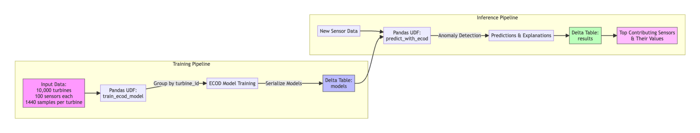

# Training 10,000 Anomaly Detection Models for Under $1 on One Billion Records with Explainable Predictions

[](https://docs.databricks.com/runtime/mlruntime.html)
[](https://github.com/databricks-industry-solutions/daxs)

DAXS (Detection of Anomalies, eXplainable and Scalable) demonstrates how to train and deploy 10,000 anomaly detection models on over one billion sensor readings for less than $1, while providing detailed explanations for each prediction. This solution showcases extreme cost optimization for large-scale industrial IoT anomaly detection.



## Overview

In today's rapidly evolving industrial landscape, detecting anomalies in manufacturing processes is crucial for maintaining efficiency and reducing downtime. DAXS leverages the ECOD (Empirical Cumulative Distribution Functions for Outlier Detection) algorithm to address three critical challenges:

1. **Explainability**: Provides transparent insights into which specific sensors or features contribute to detected anomalies, enabling quick root cause analysis.
2. **Scalability**: Handles datasets with over a billion records and trains thousands of models efficiently through one unified endpoint.
3. **Cost-Effectiveness**: Minimizes computational costs through efficient resource utilization and optimized processing techniques.

## Key Components

- **Introduction (`00_introduction.py`)**: Overview of DAXS architecture and core concepts.

- **Single Model Training (`01_explainable.py`)**: Demonstrates explainable anomaly detection using ECOD on a single model with the Elevator Predictive Maintenance Dataset. Shows how to train, evaluate, and generate explanations for anomaly predictions.

- **Scalable Training (`02_scalable.py`)**: Shows how to scale the ECOD training process to handle 10,000 models efficiently using Pandas UDFs and Spark. Demonstrates training individual models for thousands of turbines with hundreds of sensors.

- **Scalable Inference (`03_predict.py`)**: Production-ready inference pipeline that shows how to perform batch predictions with 10,000 models while maintaining explainability. Uses distributed processing to generate predictions and explanations at scale.

- **Utility Functions (`99_utilities.py`)**: Helper functions for model evaluation, metrics calculation, data generation, and anomaly explanation generation.

## Getting Started

To use DAXS, you'll need:
- A Databricks Runtime ML (DBR-ML) cluster
- Python installed along with the following library:
- pyod

You can install this dependency using pip:

```
pip install pyod
```

## Usage

1. Start by running the `01_explainable` notebook to train and evaluate the ECOD model on a smaller dataset. This notebook provides a detailed walkthrough of the internal workings of DAXS.
2. Use the `02_scalable` notebook to learn how to scale the training of ECOD models to thousands of assets.
3. Finally, the `03_predict` notebook shows how to apply the models trained in the previous notebook to a new dataset.

## Authors

<homayoon.moradi@databricks.com>, <ryuta.yoshimatsu@databricks.com>


## Contributing

DAXS is an open-source project, and we welcome contributions from data scientists, machine learning engineers, and software developers. By contributing to DAXS, you can gain valuable experience working with cutting-edge anomaly detection models and collaborate with experts in the field.

## Future Development

- Develop additional visualization tools for better interpretation of anomalies.
- Implement more advanced explainability techniques to provide deeper insights into detected anomalies.
- Include an option to deploy thousands of trained models behind a single or multiple Model Serving endpoint(s) for real time anomaly detection use cases.

DAXS has the potential to revolutionize predictive maintenance in the manufacturing industry by providing an accessible, scalable, and explainable solution for anomaly detection. Join us in developing this powerful tool to help businesses improve their operations and reduce unplanned downtime.